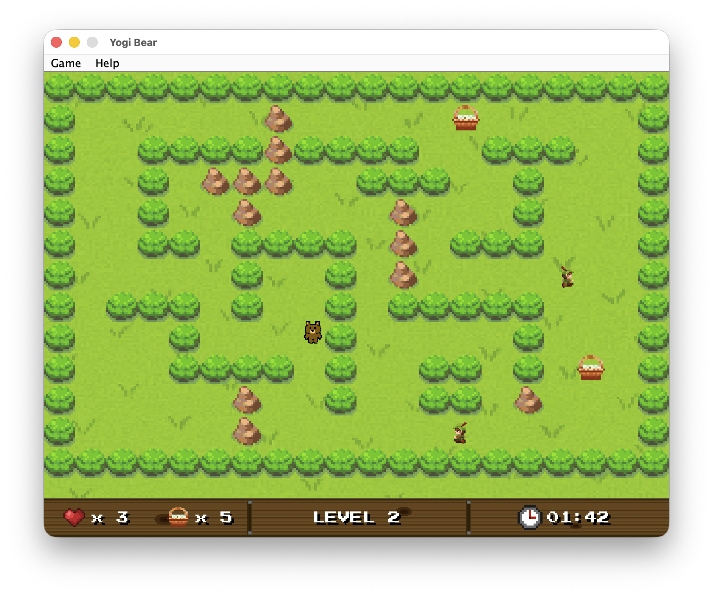

# Yogi Bear (Maci Laci) - 2D Java Game

A 2D grid-based desktop game developed in Java. The player controls Yogi Bear navigating through Yellowstone National Park, collecting picnic baskets while avoiding patrolling rangers.



## Tech Stack
- **Language:** Java 25
- **GUI Framework:** Java Swing / AWT
- **Build Tool:** Maven
- **Database:** Apache Derby
- **Testing:** JUnit 5

## Key Features
- **Custom Game Engine**: Built from scratch using `javax.swing.Timer` for a consistent 60 fps game loop.
- **Patrolling AI:** Rangers follow set paths and detect Yogi using a proximity-based system.
- **Persistent Leaderboard**: Embedded Apache Derby database that automatically initializes and stores high scores.
- **10 Custom Levels**: Increasingly difficult maps with different layouts.

## How to Run
### Option 1: Quick Start (recommended)
1. Download the latest `yogi-bear-1.0.0-release.zip` from the **Releases** section.
2. Unzip the file.
3. Run the game by double-clicking the JAR or using:
```bash
java -jar yogi-bear-1.0.0.jar
```
*Note: Ensure the `data/` folder stays in the same directory as the JAR file.*

### Option 2: Build from Source
If you want to compile the project yourself:
1. Clone the repository.
2. Build the "Fat JAR" using Maven:
```bash
mvn clean package
```
3. Find the executable in the `target/` directory.

## Controls
- **W, A, S, D**: Move Yogi Bear
- **ESC**: Pause / Resume game
